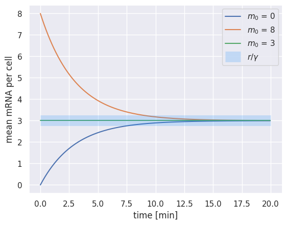
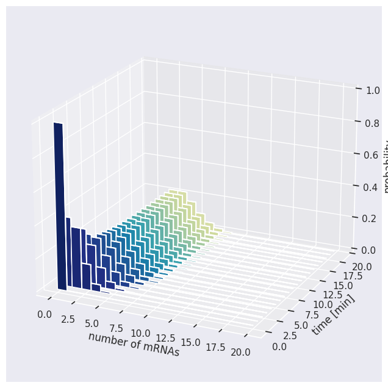
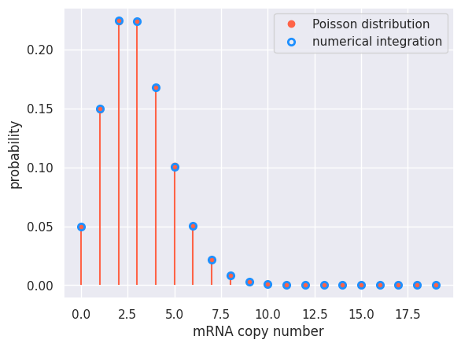

 > Note: This is a computational tutorial I wrote for a [class in physical biology](https://www.rpgroup.caltech.edu/cshl_pboc_2023/) I helped teach at CSHL in 2023. The intended audience is first/second year graduate students new to computational analysis and mathematical thinking. 

 In this tutorial, we will return to our tools of numerical integration to examine the distribution of mRNA per cell from a constitutively expressing promoter.    

 ##  The Dynamics of Constitutive Expression

Before we examine the mRNA distribution, let's examine the mean behavior of the system. By definition, a constitutive gene is one whose expression is unregulated. A cartoon for the constitutive expression is shown below.


Here, we have mathematized the cartoon as well. We say that mRNA is produced from this gene at some rate $r$ and is then degraded at a rate $\gamma$. While the production rate of mRNA is independent of the number of mRNAs present in the cell, the number of mRNAs lost to degradation is dependent on this number. We can write a differential equation describing the behavior of the mean as  

$$
{dm \over dt} = r - \gamma m. \tag{1}
$$

While we will sove this equation numerically, we can very easily solve for the mean number of mRNAs at *steady state*, or when an equal number of mRNAs are produced and degraded at each time step. Mathematically, we can say that steady state is reached when the differential equation in Eq. 1 is equal to 0,

$$
{dm \over dt} = r - \gamma m = 0. \tag{2}
$$

The steady-state mean number of mRNAs can be found by solving Eq. 2 for $m$,

$$
m = {r \over \gamma}. \tag{3}
$$

Therefore, with knowledge of the production rate $r$ and the degradation rate $\gamma$, we can very easily find the steady-state level of gene expression. Let's explore the dynamics of the mean expression using our superpower of numerical integration.

## Numerically Integrating $dm \over dt$

Much as we've done before, we can rewrite Eq. 1 by calculating the number of mRNAs after a small step forward in time $\Delta t$ as

$$
m(t + \Delta t) = \overbrace{m(t)}^\text{previous} + \underbrace{r \Delta t}_\text{production} - \overbrace{\gamma \Delta t m(t)}^\text{degradation}. \tag{4}
$$

Using the Forward Euler method, let's integrate Eq. 4 for several different starting conditions and see if we end up at the steady state expression level, $r / \gamma$. To begin, we will define some parameters.

```python

# Necessary imports for the tutorial
import numpy as np
import matplotlib.pyplot as plt
import scipy.stats
import seaborn as sns
sns.set()

# Define parameters for the integration.
r = 1 # Production rate in 1 mRNA / min
gamma = 1 / 3 # Degradation rate in inverse minutes.
dt = 1 / 30 # Time step smaller than the degradation and production rates.
total_time = 20 # Total time of the integration in minutes.
n_steps = int(total_time / dt) # The total number of time steps to be taken.


# Compute the theoretical steady-state value
steady_state = r / gamma
print(f"The predicted steady state mean value is {steady_state} mRNAs per cell.")
```
With these parameters defined, we can set up our storage vector and set some initial conditions. For expediency, we will run all three integrations at the same time!

```python
# Set up the storage vectors. This will be n_steps columns by n_sim rows.
n_sim = 3 # The number of unique starting positions
m_t = np.zeros((n_sim, n_steps))

# Set the initial conditions. We will start above, below, and at the steady state value.
m_t[1, 0] = steady_state + 5 # Above the steady state value
m_t[2, 0] = steady_state # At steady state

# Loop through each time step and execute the integration.
for i in range(1, n_steps):
    # Compute the change in mRNA number.
    dm = r * dt - gamma * dt * m_t[:, i - 1]

    # Update the total number of mRNA
    m_t[:, i] = m_t[:, i-1] + d
```

Now, let's plot the three integrations as well as a horizontal line at the steady state value.  

```python
# Set up a time vector.
time_range = np.arange(0, total_time, dt)

# Plot the three integrations.
plt.plot(time_range, m_t[0, :], label='$m_0$ = %s' %int(m_t[0, 0]))
plt.plot(time_range, m_t[1, :], label='$m_0$ = %s' %int(m_t[1, 0]))
plt.plot(time_range, m_t[2, :], label='$m_0$ = %s' %int(m_t[2, 0]))

# Plot a transparent line at the steady state value.
plt.hlines(steady_state, 0, total_time, color='dodgerblue', alpha=0.2,
           linewidth=15, label='$r / \gamma$')

# Add labels like a good scientist.
plt.xlabel('time [min]')
plt.ylabel('mean mRNA per cell')
plt.legend()
```



Here we see that no matter where we start, the system will reach the steady state value. If we start *at* the steady state value, the system will not change! While this is certainly an accomplishment, we are just solving for the mean -- this says nothing about the *distribution* of mRNAs per cell. As we discussed in our [tutorial on random walks](t03_stochastic_simulations.html), The distribution of a process is often more informative than knowing only the mean.

## Computing the mRNA Distribution

Rather than computing for the mean number of mRNA per cell, we can compute the full distribution, meaning we want to solve for the probability $P(m, t)$ for a range of mRNAs. Analytically, we would solve this for the probability across all mRNA space $[0, \infty)$. Again turning to our numerical formulation, we can write the probabability of finding $m$ mRNAs at time $t + \Delta t$ as

$$
P(m, t + \Delta t) = \overbrace{P(m, t)}^\text{previous} + \underbrace{r  \Delta t  P(m - 1, t) + \gamma(m+1)  \Delta t  P(m + 1, t)}_\text{production} - \overbrace{r  \Delta t P(m, t) - \gamma (m) \Delta t P(m, t)}^\text{degradation}. \tag{5}
$$

Notice that we have $\gamma$ present in *both* our production and degradation terms! We can gain an mRNA by either producing one at a rate $r$, given the probability of having $m-1$ mRNAs or we can gain probability by *degrading* an mRNA, given the probability of having $m+1$ mRNAs.

With Eq. 5 well stated, we can begin our integration. Much as in our [tutorial on chemical master equations](t04_chemical_master_equations.html), we need to be careful about our boundary conditions. We can't integrate over an infinite number of mRNAs, so we will impose a large upper limit of the mRNAs that we can have. We will set this large enough such that we don't actually reach the end. Below, we start by defining some dimensional parameters.

```python
# Change the total time
total_time = 20
n_steps = int(total_time / dt)
# Define the number of mRNAs we will integrate over
max_mRNA = 20

# Set up the matrix to store the probability of mRNAs
prob = np.zeros((max_mRNA, n_steps))

# Set the initial condition of maximal probability at 0 mRNA.
prob[0, 0] = 1
```

With our matrix defined, we can integrate, assuming we have no mRNA to begin with


```python
# Loop over each time point.
for t in range(1, n_steps):
    # Compute the cases for the boundary  conditions.
    prob[0, t] = prob[0, t-1] + gamma * dt * prob[1, t-1] - r * dt * prob[0, t-1]
    prob[-1, t] = prob[-1, t-1] + r * dt * prob[-2, t-1] - gamma * (max_mRNA) * dt * prob[-1, t-1]

    # Iterate through all of the mRNAs and properly integrate.
    for m in range(1, max_mRNA - 1):
        # Compute the production terms.
        pm_add = r * dt * prob[m-1, t-1] + gamma * (m + 1) * dt * prob[m+1, t-1]

        # Compute the degradation term
        pm_sub = r * dt * prob[m, t-1] + gamma * m * dt * prob[m, t-1]

        # Update the probability
        prob[m, t] = prob[m, t-1] + pm_add - pm_sub
```

And just like that, the integration is finished! Let's look at the time evolution of this distribution using a three dimensional bar plot. To do this, we will need to use some of matplotlib's 3d-plotting abilities. Rather than get into the syntax, I've defined a function below that we can use to easily generate it.

```python
from mpl_toolkits.mplot3d import Axes3D
def bar_plot (data, n_slices, dx = 1, dy = 1, z_max = 1, x_label = 'x',
              y_label='y', z_label='z', elev_angle = 20, azim_angle = -65):
    """
    Makes a 3d bar plot of the data given as a 2d numpy array.

    Parameters
    ----------
    data: 2d-array
        Two-dimensional numpy array of z-values
    n_slices: int
        Number of 'slices' in y-directions to be used in the 3D plot
    dx: float
        Distance between neighboring x-positions
    dy: float
        Distance between neighboring y-positions
    x_label: str
        Label of the x-axis
    y_label: str
        Label of the y-axis
    z_lable: str
        Label of the z-axis
    elev_angle: int
        Alevation viewing angle
    azim_angle: int
        Azimuthal viewing angle
    z_max: float
        Default limit to the z-axis

    Returns
    -------
    fig: pyplot figure object
        Figure of the 3d-plot

    ax: pyplot axes object
        Axes object that contains the figure elements
    """

    # Initialize the figure object
    fig = plt.figure(figsize = [10, 8])
    ax = fig.add_subplot(111, projection='3d')

    # Colors to indicate variation in y-axis
    colors = sns.color_palette('YlGnBu_r', n_colors=n_slices+1)

    # Dimensions of the 2d-array
    x_length, y_length = data.shape

    # Initial index of the slice
    i_slice = 0

    # Iterate through each slice and add bar plots
    for y in np.arange(0, y_length, y_length//n_slices):

        # x-, y- and z-positions
        x_pos = np.arange(x_length)*dx
        y_pos = y*np.ones(x_length)*dy
        z_pos = np.zeros(x_length)

        # Horizontal dimensions of the bars
        delta_x = dx*np.ones(x_length)
        delta_y = 2*dy*np.ones(x_length)

        # Heights in the z-direction
        delta_z = data[:,y]

        ax.bar3d(x_pos, y_pos, z_pos, delta_x, delta_y, delta_z,
                 color = colors[i_slice])

        i_slice = i_slice + 1;

    # Add axis labels
    ax.set_xlabel(x_label)
    ax.set_ylabel(y_label)
    ax.set_zlabel(z_label)

    # Adjust the 3d viewing angle of the plot
    ax.view_init(elev_angle, azim_angle)

    # Set the z-limit of the plot
    z_max = np.min([z_max, np.max(data)])
    ax.set_zlim([0, z_max])

    return fig, ax

# Make a three dimensional bar plot of the time evolution.
figure, axis = bar_plot(prob, 20, dy=dt, x_label='number of mRNAs', y_label='time [min]', z_label='probability')
```



Much as we saw when we examined the dynamics of the mean, we see that after some time, we reach the steady state. The *mean* value of this distribution is at 3, but we see that we have some probability mass extending all the way to 10 mRNAs per cell!

##  An Analytical Solution For The Steady-State Distribution

How accurate was our integration? We can analytically solve for the steady state distribution given Eq. 5. At steady state, the change in probability for *each mRNA count* should be equal to zero. In class, we solved for the steady state distribution for the first three mRNA copy numbers. We saw a pattern that can be generalized to

$$
P(m=n) = {1 \over n!}\left({r \over \gamma}\right)^n P(m=0). \tag{6}
$$

In Eq. 6, we still have $P(m=0)$ hanging around. We can solve for this by realized that $P(m=0)$ is a normalization constant. This can be seen that the infinite sum over all mRNAs should be equal to 1,

$$
\sum\limits_{n=0}^\infty P(m=n) = 1. \tag{7}
$$

As $P(m=n)$ is a function of $P(m=0)$, Eq. 7 can be rewritten as

$$
\sum\limits_{n=0}^\infty P(m=n) = {1 \over n!}\left({r \over \gamma}\right)^n P(m=0) = 1. \tag{8}
$$

As $P(m=0)$ is present in *each* $n$, we can pull it out of the sum as

$$
P(m=0) \sum\limits_{n=0}^\infty {1 \over n!}\left({r \over \gamma}\right)^n = 1. \tag{9}
$$

Solving for $P(m=0)$, we find that it is just a normalization constant,

$$
P(m=0) = {1 \over \sum\limits_{n=0}^\infty {1 \over n!}\left({r \over \gamma}\right)^n}. \tag{10}
$$

Performing a taylor expansion of Eq. 6 using our definition of $P(m=0)$ in Eq. 10 reveals a beautifully succinct expression,

$$
P(m=n) = {1 \over n!}\left({r \over \gamma}\right)^n e^{r \over \gamma}. \tag{11}
$$

This is known as the [Poisson distribution](https://en.wikipedia.org/wiki/Poisson_distribution) and comes up over and over again throughout all of biology and physics.


With an analytical solution for the steady state distribution in hand, let's compare it to our numerical integration. We will look at the final time point of our integration and plot the probability for each mRNA copy number overlaid with the Poisson distribution.

```python
# Define the mRNA range for the poisson.
mRNA_range = np.arange(0, max_mRNA, 1)

# Compute the poisson probability density function.
poisson = scipy.stats.poisson.pmf(mRNA_range, r / gamma)

# Plot the Poisson distribution as sticks and balls.
plt.plot(mRNA_range, poisson, 'o', color='tomato', label='Poisson distribution')
plt.vlines(mRNA_range, 0, poisson, color='tomato')

# Plot the result from our numerical integration as open circles
plt.plot(mRNA_range, prob[:, -1], 'o', label='numerical integration',
        markerfacecolor='none', markeredgewidth=2, markeredgecolor='dodgerblue')

# Add labels and legends
plt.xlabel('mRNA copy number')
plt.ylabel('probability')
plt.legend()
```



Again, we see that our analytical solution matches exactly what we got from our numerical integration!

## In Conclusion...
In this tutorial, we have again flexed our muscles for numerical integration using the Forward-Euler method in the biological context of mRNA expression. From here, we will examine the rich family of equilibrium models with more complex expression patterns, as is the case in regulated expression.   

