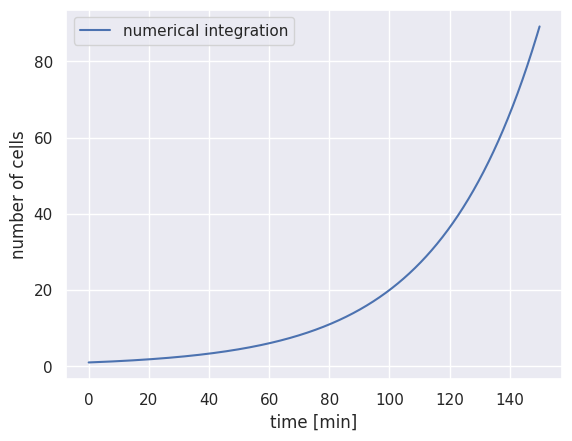
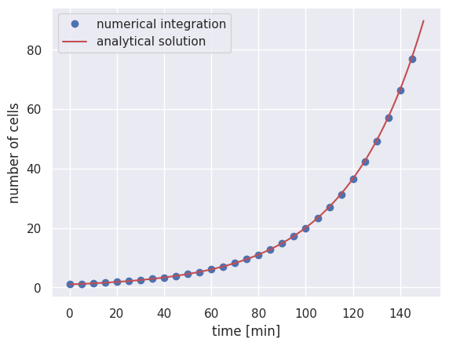
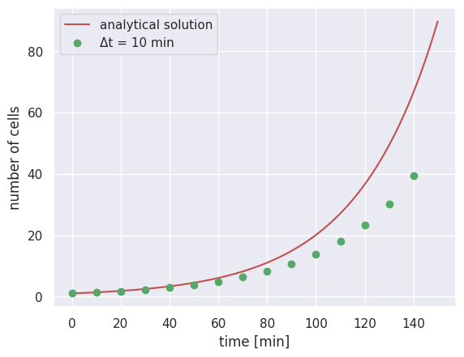
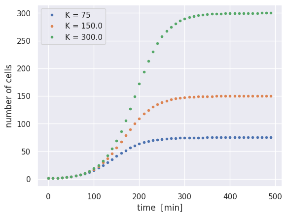
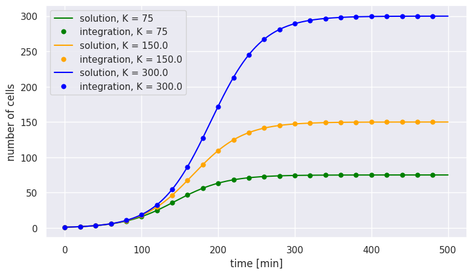

> Note: This is a computational tutorial I wrote for a [class in physical biology](https://www.rpgroup.caltech.edu/cshl_pboc_2023/) I helped teach at CSHL in 2023. The intended audience is first/second year graduate students new to computational analysis and mathematical thinking. 

In this tutorial, we will explore exponential growth through numerical integration — a handy technique for numerically evaluating differential equations.

## The Growth of Populations

In class, we used some simple back-of-the-envelope estimates to figure out what
sets the speed limit for bacterial growth. But what does this speed limit mean
for the growth of populations? To answer this question, we turn to writing a
simple ordinary differential equation.

Throughout the course, we will repeatedly mathematize our thinking using
differential equations. For example, we can write a differential equation for a
growing bacterial culture as

$$
{dN \over dt} = r N(t),
$$

where $N$ is the number of cells, $t$ is time (in whatever units we deem appropriate), and $r$ is the rate of bacterial growth. This differential equation can be very easily solved for $N(t)$ as

$$
N(t) = N_0 e^{rt},
$$

where $N_0$ is the initial number of starting cells. While getting to this result is relatively simple, this will certainly not be the case for every differential equation we write! In some cases, there may not even be a closed form solution. To solve such equations, we will have to turn to our computers to do the work for us.

## The Forward-Euler Algorithm

There are seemingly countless numerical integrators available to you in nearly all computer programming languages. The simplest and easiest to code (although it has some limitations) is the Forward-Euler method. In this approach, we take very small steps forward in time, calculate the change in our quantity of interest, and then add that change to our result from the previous time step.

Let's look back at our differential equation, but rewrite it in a different way. We can say that the number of cells present at some time $t + \Delta t$ is

$$
N(t + \Delta t) = N(t) + r N(t) \Delta t.
$$

Taking yet another step forward in time could similarly be stated as

$$
N(t + 2\Delta t) = N(t + \Delta t) + r N(t + \Delta t) \Delta t.
$$

At each time step, we are simply adding the number of cells added in that interval $\Delta t$ as was defined in our initial differential equation.

But how do we choose our time step? For this approach to work, we must take steps forward in time that are sufficiently small such that no more than one event described in our model can take place. In the context of exponential growth, for example, we would not want to take steps forward in time that are larger than the growth rate where multiple divisions could occur. This requirement, known as the Courant-Friedrichs-Lewy (CFL) condition, is important for many types of time-marching computer simulations.

## Implementation

Let's put our euros where our mouth is and code up this integrator for the case of simple exponential growth. Before we jump right in we need to define some parameters first:

```python
import numpy as np
import matplotlib.pyplot as plt

# Define parameters for the exponential growth
N_0 = 1        # Initial number of cells
r = 0.03       # Growth rate in generations per minute
total_time = 150  # Total time of the integration in minutes
```

We now need to set the time step for our integrator. We'll start with a sufficiently small time step that will give proper integration, but not too small as to seriously slow down our computers:

```python
# Define parameters for the numerical integrator
delta_t = 0.1  # time step in minutes
n_time_steps = int(total_time / delta_t)
```

In the above code cell, we defined the size of our time step and figured out how many we will need to take given the total time of our experiment. While `n_time_steps` is an integer quantity (you can't have 1.3 steps!), simply dividing `total_time` by `delta_t` would result in a floating point number. By adding `int(...)`, we force the result to be an integer.

We now have just about everything we need to begin our integration. The last thing we need to do is set our initial condition and create a vector to store our results:

```python
# Set up the empty vector where we will store the number of cells at time t
N_t = np.zeros(n_time_steps)

# Set the initial condition by indexing the array
N_t[0] = N_0
```

We're now ready to do the integration! Starting at the second time point (index `1`), we'll calculate how many cells were added in a single time step and update our storage vector:

```python
# Loop through each time step
for t in range(1, n_time_steps):
    # Calculate the change in the number of cells
    dN = N_t[t - 1] * r * delta_t

    # Update the number of cells at the current time point
    N_t[t] = N_t[t - 1] + dN
```

And that's it! Because of the simplicity of this problem, this code should run almost instantaneously. Let's plot our result to see if we got exponential growth:

```python
# Set up the time array for the x axis
time_range = np.arange(0, total_time, delta_t)

# Plot our calculation
plt.plot(time_range, N_t, 'b-', label='numerical integration')
plt.xlabel('time [min]')
plt.ylabel('number of cells')
plt.legend()
```


What a relief! We've been able to numerically integrate Eq. 1 by hand. To ensure that we get the correct result, we can plot a subset of points from the numerical integration over our analytical solution in Eq. 2. 


```python
# Compute the analytical solution
solution = N_0 * np.exp(r * time_range)

# Plot every 50 points from the numerical integration
plt.plot(time_range[::50], N_t[::50], 'bo', label='numerical integration')

# Plot the analytical solution as a red line
plt.plot(time_range, solution, 'r-', label='analytical solution')

plt.xlabel('time [min]')
plt.ylabel('number of cells')
plt.legend()
```


It looks like our simple numerical integrator works as advertised and converges to the analytical result. Of course, you cannot always use this as a sanity check as you often won't have the analytical solution.

## Breaking the CFL Condition

As mentioned earlier, the stability of this method depends entirely on us taking a short enough time step such that we only observe at most one event. Let's now try to break that by taking a longer time step, say `delta_t = 10`:

```python
# Set the new parameters
delta_t_long = 10
n_time_steps_long = int(total_time / delta_t_long)

# Set up storage vector
N_t_long = np.zeros(n_time_steps_long)
N_t_long[0] = N_0

# Loop through each time step
for t in range(1, n_time_steps_long):
    dN = N_t_long[t - 1] * r * delta_t_long
    N_t_long[t] = N_t_long[t - 1] + dN

# Plot comparison
time_range_long = np.arange(0, total_time, delta_t_long)
plt.plot(time_range, solution, 'r-', label='analytical solution')
plt.plot(time_range_long, N_t_long, 'go', label='Δt = 10 min')
plt.xlabel('time [min]')
plt.ylabel('number of cells')
plt.legend()
```


We see here that for the first few points, our numerical integration is noticeably different from the analytical solution, revealing that our time step was too long. Before you launch an integration yourself, be sure to take time and think carefully about the parameters you have fed in!

## Exercise: The Logistic Growth Equation

While unrestricted exponential growth seems logical, it is only valid for a limited time scale. Without some kind of feedback, this growth law states that cells would continue to grow exponentially *forever*. However, we know that cells have limitations, whether it be the availability of carbon or the space available for new cells to grow into. Such restrictions put a limit on the maximal number of cells that can inhabit a given environment, known as the **carrying capacity**.

This concept was first put forward in 1838 by [François Verhulst](https://www.google.com/url?q=https%3A%2F%2Fen.wikipedia.org%2Fwiki%2FPierre_Fran%25C3%25A7ois_Verhulst) and mathematized as

$$
{dN \over dt} = rN(t)\left(1 - {N(t) \over K}\right),
$$

where we've introduced $K$ as the carrying capacity. From looking at this equation, we can see that as the total number of cells gets closer and closer to $K$, the number of cells added during a particular time step gets smaller and smaller until the carrying capacity is met ($N = K$).

Unlike simple exponential growth, this differential equation is much less trivial to solve. Let's put our skills of numerical integration to the test:

```python
# Set the carrying capacities to test
K = [75, 150, 300]

# Extend the total time of the integration
delta_t = 0.1
total_time = 500
time_range = np.arange(0, total_time, delta_t)
n_time_steps = int(total_time / delta_t)

# Storage array for all carrying capacities
N_t = np.zeros((len(K), n_time_steps))
N_t[:, 0] = N_0

# Loop through each carrying capacity
for k in range(len(K)):
    for t in range(1, n_time_steps):
        # Calculate change with logistic term
        dN = N_t[k, t-1] * r * delta_t * (1 - N_t[k, t-1] / K[k])
        N_t[k, t] = N_t[k, t-1] + dN

# Plot results
for i in range(len(K)):
    plt.plot(time_range[::100], N_t[i, ::100], '.', label=f'K = {K[i]}')

plt.xlabel('time [min]')
plt.ylabel('number of cells')
plt.legend()
```


While the rate of growth is the same for all three cases, the imposed carrying capacity causes growth to cease at different times. We also see that growth slows down gradually as the carrying capacity is approached, rather than simply rocketing to the carrying capacity at the maximal rate.

## Analytical Solution for Logistic Growth

As mentioned above, there is an analytical solution for the logistic growth model, although it is less straightforward to solve than simple exponential growth. For posterity's sake, we will solve the logistic growth differential equation and plot it over the solution found through numerical integration.

By separation of variables, we can rewrite the logistic equation as

$$
r \, dt = {dN \over N\left(1 - {N \over K}\right)}.
$$

We can now integrate both sides,

$$
\int r \, dt = \int {1 \over N \left(1 - {N \over K}\right)} dN,
$$

but the integral on the right side is quite difficult to solve. As a first step, we can use a [partial fraction decomposition](https://www.google.com/url?q=https%3A%2F%2Fen.wikipedia.org%2Fwiki%2FPartial_fraction_decomposition) to break the integrand into two pieces,

$$
{1 \over N\left(1 - {N \over K}\right)} = {A \over N} + {B \over 1 - {N  \over K}},
$$

where $A$ and $B$ are unknown constants. We can clear the fractions as

$$
1 = A\left(1 - {N \over K}\right) + BN.
$$

This formulation allows us to identify the constants $A$ and $B$ by looking at the extrema. When $N = 0$, we find

$$
1 = A \times (1 - 0) + B \times 0,
$$

meaning that $A = 1$. Conversely, when $N = K$, we find

$$
B = {1 \over K}.
$$

The right-hand integral can now be rewritten as

$$
\int {1 \over N\left(1 - {N \over K}\right)} dN = \int {1 \over N} dN + \int {{1 \over K} \over 1 - {N \over K}} dN.
$$

Using u-substitution for the right-hand integral, we can now integrate both sides, arriving at

$$
rt + C = \ln N - \ln \left(1 - {N \over K}\right),
$$

where $C$ is a constant of integration. Exponentiating both sides and solving for $N$ yields

$$
N = {e^C e^{rt} \over 1 + {e^{C}e^{rt} \over K}}.
$$

We can massage this into a more friendly form by multiplying the top and bottom by $Ke^{-rt}$ to arrive at

$$
N = {e^C K \over Ke^{-rt} + e^C}.
$$

We are still left with our constant of integration $C$ hanging around in our equation. We can determine this constant by noticing that at our initial time $t = 0$, the number of cells $N_0$ is

$$
N_0 = {e^C K \over K + e^C},
$$

which, with some rearrangement, gives us

$$
e^C = {N_0 K \over K - N_0}.
$$

We can now plug this back in and do some algebra to arrive at our analytical solution for the number of cells at time $t$ as

$$
N(t) = {N_0 K \over e^{-rt}(K - N_0) + N_0}.
$$

Though still manageable, this is not nearly as trivial as finding the analytical solution for unrestricted exponential growth! For a quick sanity check, we can plot this analytical solution over the results from our numerical integration:

```python
# Solve the analytical solution for our three carrying capacities
solution = np.zeros((len(K), n_time_steps))
for i in range(len(K)):
    solution[i, :] = N_0 * K[i] / (np.exp(-r * time_range) * (K[i] - N_0) + N_0)

colors = ['green', 'orange', 'blue']

for i in range(len(K)):
    # Analytical solution (line)
    plt.plot(time_range, solution[i,:], color=colors[i],
             label=f'solution, K = {K[i]}')
    # Numerical integration (points)
    plt.plot(time_range[::200], N_t[i, ::200], '.', markersize=10,
             color=colors[i], label=f'integration, K = {K[i]}')

plt.xlabel('time [min]')
plt.ylabel('number of cells')
plt.legend()
```


Again, we see that our simple numerical integration gave us the same result as our analytical solution.

## Conclusion

While having an analytical solution is often very desirable, it's not always necessary. It's up to you to decide when you need to grind through the math to get the solution versus using numerical integration.

While we used the Forward-Euler method to perform these integrations, this method is rather unstable and there are some differential equations for which it simply will not work. In your research, you will want to use integration packages in the programming language of your choice (such as [`scipy.integrate.odeint`](https://www.google.com/url?q=https%3A%2F%2Fdocs.scipy.org%2Fdoc%2Fscipy%2Freference%2Fgenerated%2Fscipy.integrate.odeint.html) for Python or [`ode45`](https://www.google.com/url?q=https%3A%2F%2Fwww.mathworks.com%2Fhelp%2Fmatlab%2Fref%2Fode45.html) in MATLAB). These methods, though more complicated, are far faster and more robust to pathological functions than the Forward-Euler method.
